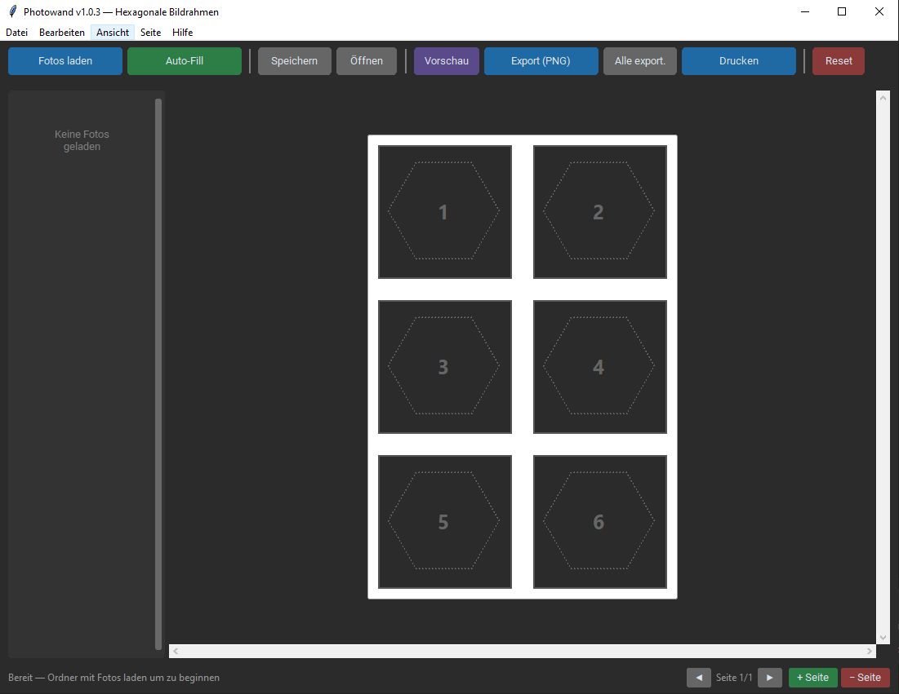
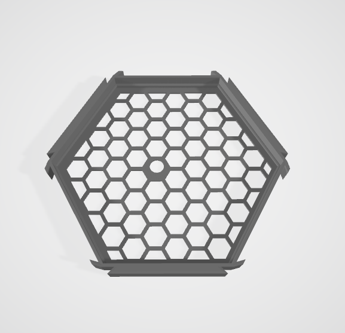
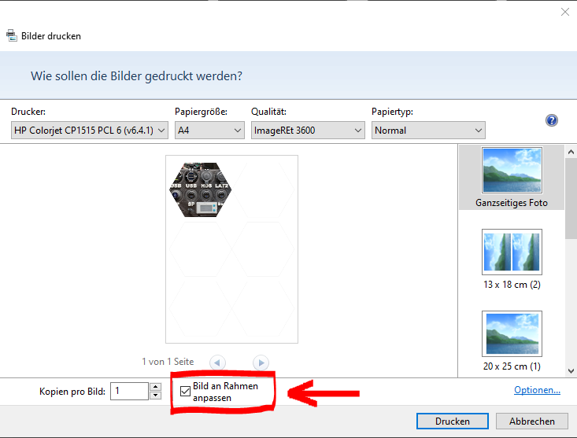

# Photowand

> **[English version below](#english)**

**Portable Windows-Anwendung zum Erstellen von Foto-Einsätzen für 3D-gedruckte hexagonale Bilderrahmen.**

Photowand wurde entwickelt, um Fotos passgenau in sechseckige (Flat-Top oder Pointy-Top) Bilderrahmen einzusetzen, die per 3D-Drucker hergestellt werden. Die Fotos werden hexagonal zugeschnitten, auf einem Druckblatt (A5 bis A0) angeordnet und können direkt ausgedruckt oder als 300-DPI-PNG exportiert werden — zum Ausschneiden und Einsetzen in die physischen Rahmen.



---

## Für welchen Rahmen?

Photowand ist auf den mitgelieferten **Hex Picture Frame** (`Hex_Picture_Frame.stl`) ausgelegt:

| Eigenschaft | Wert |
|---|---|
| Orientierung | Flat-Top oder Pointy-Top (umschaltbar) |
| Umkreisradius | ~50,9 mm (Mitte → Ecke) |
| Apothem | ~44,1 mm (Mitte → Seitenmitte) |
| Flat-to-Flat | ~88,2 mm |
| Ecke-zu-Ecke | ~101,8 mm |

### 3D-Modell

<p align="center">
  
</p>

<p align="center">
  <a href="Hex_Picture_Frame.stl">
    <code>Hex_Picture_Frame.stl</code> herunterladen
  </a>
</p>

> Die STL-Datei kann direkt im GitHub-Repository per 3D-Viewer betrachtet werden: Einfach auf [`Hex_Picture_Frame.stl`](Hex_Picture_Frame.stl) klicken.

---

## Features

- **Foto-Import** — Ordner laden oder Drag & Drop aus dem Explorer
- **Interaktive Hexagon-Slots** — Fotos per Klick zuweisen
- **Zoom & Pan** — Mausrad = Foto-Zoom, Ziehen = Foto-Verschieben, Doppelklick = Reset
- **Foto-Rotation** — Fotos um 90°, 180° oder 270° drehen (Rechtsklick-Menü)
- **Drag & Drop zwischen Slots** — Fotos per Maus zwischen Hexagonen tauschen
- **Vorschau-Zoom** — Ctrl+Mausrad zum Vergrößern der gesamten Vorlage
- **Auto-Fill** — Fotos automatisch der Reihe nach zuweisen (seitenübergreifend ohne Duplikate)
- **Mehrseitig** — Beliebig viele Seiten, Seiten hinzufügen und löschen
- **Papierformate** — A5, A4, A3, A2, A1, A0 (automatische Slot-Berechnung)
- **Pointy-Top Orientierung** — Umschaltbar zwischen Flat-Top und Pointy-Top Hexagonen
- **Schnittlinien** — Ein-/ausschaltbare Schnittmarkierungen zum Ausschneiden
- **Beschriftung** — Optionale Dateinamen unter den Hexagonen (im Druckbild)
- **Druck-Vorschau** — Vorschau mit Seitennavigation vor dem Drucken
- **Export (300 DPI)** — PNG-Export in Druckqualität (einzeln oder alle Seiten)
- **Drucken** — Direkter Windows-Druckdialog
- **Projekt speichern/laden** — `.photowand`-Dateien zum Weitermachen
- **Undo/Redo** — Ctrl+Z / Ctrl+Y (bis zu 30 Schritte)
- **Rechtsklick-Menü** — Foto entfernen, drehen, ersetzen, Zoom zurücksetzen, Beschriftung bearbeiten, Slots tauschen
- **Windows-Menüleiste** — Datei, Bearbeiten, Ansicht, Seite, Hilfe
- **Foto-Seitenleiste** — Ordnerpfad-Anzeige, Thumbnails mit Dateinamen
- **Integrierte Anleitung** — Hilfe-Menü mit vollständiger Funktionsbeschreibung

---

## Anleitung

### 1. Fotos laden
Klicke auf **Fotos laden** und wähle einen Ordner mit Bildern. Alternativ: Dateien oder Ordner per Drag & Drop in das Fenster ziehen. Die Fotos erscheinen als Thumbnails in der linken Seitenleiste — mit Ordnerpfad und Dateinamen.

### 2. Fotos zuweisen
**Manuell:** Klicke auf ein Foto in der Seitenleiste, dann auf einen Hexagon-Slot.
**Automatisch:** Klicke auf **Auto-Fill** — die Fotos werden der Reihe nach in leere Slots eingefügt.

### 3. Fotos anpassen
- **Mausrad** auf einem Slot → Foto hinein-/herauszoomen
- **Linke Maustaste + Ziehen** → Foto innerhalb des Hexagons verschieben
- **Doppelklick** → Zoom und Position zurücksetzen
- **Rechtsklick** → Kontextmenü mit folgenden Optionen:
  - Foto entfernen / ersetzen
  - Drehen (90° rechts, 180°, 90° links)
  - Zoom zurücksetzen
  - Beschriftung bearbeiten
  - Tauschen mit einem anderen Slot

### 4. Drag & Drop zwischen Slots
Ziehe ein belegtes Hexagon mit der Maus auf ein anderes Hexagon, um die Fotos zu tauschen. Der Ziel-Slot wird beim Überfahren hervorgehoben.

### 5. Vorschau zoomen (für große Formate)
- **Ctrl + Mausrad** → Gesamte Vorlage vergrößern/verkleinern
- **Mittlere Maustaste + Ziehen** → Ansicht verschieben
- **Scrollbars** → Navigation bei großen Formaten

### 6. Mehrere Seiten
Klicke auf **+ Seite** in der Statusleiste für eine neue Seite. Mit **◀ ▶** zwischen Seiten wechseln. **− Seite** löscht die aktuelle Seite. Auto-Fill überspringt automatisch bereits verwendete Fotos.

### 7. Ansicht-Optionen (Menü „Ansicht")
- **Schnittlinien** — Gestrichelte Schnittlinien um die Hexagone ein-/ausschalten
- **Beschriftung** — Dateinamen unter den Hexagonen im Druckbild anzeigen
- **Pointy-Top Orientierung** — Hexagone zwischen Flat-Top und Pointy-Top umschalten
- **Papierformat** — Zwischen A5, A4, A3, A2, A1 und A0 wechseln

### 8. Exportieren / Drucken
- **Vorschau** → Druckvorschau mit Seitenblätterung
- **Export (PNG)** → 300-DPI-PNG der aktuellen Seite speichern
- **Alle exportieren** → Alle Seiten als separate PNG-Dateien in einen Ordner
- **Drucken** → Öffnet den Windows-Druckdialog

> **Wichtig beim Drucken:** Im Windows-Druckdialog muss die Checkbox **„Bild an Rahmen anpassen"** aktiviert bleiben (ist standardmäßig gesetzt). Nur so werden die Hexagone in der korrekten Größe gedruckt und passen exakt in die 3D-gedruckten Rahmen.



### 9. Fotos in den Rahmen einsetzen
Die ausgeschnittenen Fotos werden mit **doppelseitigen Foto-Klebepads** in die hexagonalen Rahmen eingesetzt. So lassen sich die Bilder sauber und rückstandsfrei befestigen.

### 10. Projekt speichern
- **Speichern** (Ctrl+S) → `.photowand`-Projektdatei erstellen
- **Öffnen** (Ctrl+O) → Gespeichertes Projekt wiederherstellen

Alle Foto-Zuweisungen, Zoom-Einstellungen, Rotationen, Beschriftungen und die Hexagon-Orientierung werden gesichert.

---

## Tastenkürzel

| Taste | Aktion |
|---|---|
| Ctrl+S | Projekt speichern |
| Ctrl+O | Projekt öffnen |
| Ctrl+Z | Rückgängig |
| Ctrl+Y | Wiederherstellen |
| Ctrl+Mausrad | Vorschau-Zoom |
| Mausrad (auf Slot) | Foto-Zoom |
| Doppelklick (auf Slot) | Zoom/Position zurücksetzen |

---

## Technologie-Stack

| Komponente | Technologie | Version |
|---|---|---|
| Sprache | Python | 3.13+ |
| GUI-Framework | CustomTkinter | >= 5.2.0 |
| Bildverarbeitung | Pillow (PIL) | >= 10.0.0 |
| Drag & Drop | tkinterdnd2 | >= 0.4.2 |
| Verpackung | PyInstaller | 6.19.0 |
| Plattform | Windows | 10/11 |

---

## Installation & Build

### Voraussetzungen
- Python 3.13+
- Windows 10/11

### Abhängigkeiten installieren
```bash
pip install -r requirements.txt
```

### Aus Quellcode starten
```bash
python -m photowand
```

### Standalone .exe bauen
```bash
pip install pyinstaller
python -m PyInstaller --noconfirm build/photowand.spec
```

Die fertige `Photowand.exe` liegt danach im `dist/`-Ordner.

---

## Projektstruktur

```
photowand/
  main.py                  # Einstiegspunkt
  app.py                   # Hauptfenster & Orchestrierung
  models.py                # HexSlotData Datenklasse
  core/
    hexagon.py             # Hexagon-Geometrie (Vertices, mm/px)
    layout.py              # Layout-Engine (A5–A0, Slot-Positionen)
    renderer.py            # 300-DPI-Druckbild-Renderer
    image_utils.py         # Bildladen, EXIF-Korrektur
    project.py             # Projekt speichern/laden (.photowand)
  gui/
    hex_canvas.py          # Interaktives Hexagon-Widget (Zoom/Pan/Rotation)
    a4_preview.py          # Seitenvorschau mit Scroll & Zoom
    toolbar.py             # Werkzeugleiste
    photo_strip.py         # Foto-Seitenleiste (Thumbnails + Dateinamen)
    vorschau_dialog.py     # Druck-Vorschau-Dialog
```

---

## Lizenz

Dieses Projekt ist frei zur persönlichen Nutzung.

---
---

<a name="english"></a>

# Photowand (English)

**Portable Windows application for creating photo inserts for 3D-printed hexagonal picture frames.**

Photowand was designed to precisely fit photos into hexagonal (flat-top or pointy-top) picture frames produced with a 3D printer. Photos are clipped to a hexagonal shape, arranged on a print sheet (A5 to A0), and can be printed directly or exported as a 300 DPI PNG — ready to cut out and insert into the physical frames.


---

## Which Frame Is This For?

Photowand is tailored to the included **Hex Picture Frame** (`Hex_Picture_Frame.stl`):

| Property | Value |
|---|---|
| Orientation | Flat-top or pointy-top (switchable) |
| Circumradius | ~50.9 mm (center → corner) |
| Apothem | ~44.1 mm (center → edge midpoint) |
| Flat-to-flat | ~88.2 mm |
| Corner-to-corner | ~101.8 mm |

### 3D Model

<p align="center">
  
</p>

<p align="center">
  <a href="Hex_Picture_Frame.stl">
    Download <code>Hex_Picture_Frame.stl</code>
  </a>
</p>

> The STL file can be viewed directly in the GitHub repository using the built-in 3D viewer — just click on [`Hex_Picture_Frame.stl`](Hex_Picture_Frame.stl).

---

## Features

- **Photo Import** — Load a folder or drag & drop files from Explorer
- **Interactive Hexagon Slots** — Assign photos with a click
- **Zoom & Pan** — Scroll wheel = photo zoom, drag = photo pan, double-click = reset
- **Photo Rotation** — Rotate photos by 90°, 180° or 270° (right-click menu)
- **Drag & Drop Between Slots** — Swap photos between hexagons by dragging
- **Preview Zoom** — Ctrl+Scroll to zoom the entire template for large formats
- **Auto-Fill** — Automatically assign photos in order (cross-page, no duplicates)
- **Multi-Page** — Unlimited pages, add and delete pages freely
- **Paper Formats** — A5, A4, A3, A2, A1, A0 (automatic slot calculation)
- **Pointy-Top Orientation** — Switch between flat-top and pointy-top hexagons
- **Cut Lines** — Toggleable cut marks for easy cutting
- **Labels** — Optional filenames below hexagons in the print output
- **Print Preview** — Preview with page navigation before printing
- **Export (300 DPI)** — Print-quality PNG export (single page or all pages)
- **Print** — Direct Windows print dialog
- **Save/Load Projects** — `.photowand` project files to pick up where you left off
- **Undo/Redo** — Ctrl+Z / Ctrl+Y (up to 30 steps)
- **Right-Click Menu** — Remove, rotate, replace photo, reset zoom, edit label, swap slots
- **Windows Menu Bar** — File, Edit, View, Page, Help
- **Photo Sidebar** — Folder path display, thumbnails with filenames
- **Built-in Guide** — Help menu with full feature documentation

---

## How to Use

### 1. Load Photos
Click **Fotos laden** (Load Photos) and select a folder containing images. Alternatively, drag & drop files or folders into the application window. Photos appear as thumbnails in the left sidebar — with folder path and filenames.

### 2. Assign Photos
**Manual:** Click a photo thumbnail in the sidebar, then click a hexagon slot to place it.
**Automatic:** Click **Auto-Fill** — photos are assigned sequentially to empty slots.

### 3. Adjust Photos
- **Scroll wheel** on a slot → Zoom in/out on the photo
- **Left-click + drag** → Pan the photo within the hexagon
- **Double-click** → Reset zoom and position
- **Right-click** → Context menu with the following options:
  - Remove / replace photo
  - Rotate (90° right, 180°, 90° left)
  - Reset zoom
  - Edit label
  - Swap with another slot

### 4. Drag & Drop Between Slots
Drag a filled hexagon onto another hexagon to swap photos. The target slot is highlighted when hovered over.

### 5. Zoom the Preview (for Large Formats)
- **Ctrl + Scroll wheel** → Zoom the entire template in/out
- **Middle mouse button + drag** → Pan the view
- **Scrollbars** → Navigate large format templates

### 6. Multiple Pages
Click **+ Seite** (+ Page) in the status bar to add a new page. Use **◀ ▶** to navigate between pages. **− Seite** (− Page) deletes the current page. Auto-Fill automatically skips photos already used on other pages.

### 7. View Options (View Menu)
- **Schnittlinien** (Cut Lines) — Toggle dashed cut lines around hexagons
- **Beschriftung** (Labels) — Show filenames below hexagons in the print output
- **Pointy-Top Orientierung** (Pointy-Top Orientation) — Switch hexagons between flat-top and pointy-top
- **Papierformat** (Paper Format) — Switch between A5, A4, A3, A2, A1 and A0

### 8. Export / Print
- **Vorschau** (Preview) → Print preview with page browsing
- **Export (PNG)** → Save current page as 300 DPI PNG
- **Alle exportieren** (Export All) → Export all pages as separate PNG files to a folder
- **Drucken** (Print) → Opens the Windows print dialog

> **Important when printing:** In the Windows print dialog, the checkbox **"Fit picture to frame"** must remain checked (it is enabled by default). This ensures the hexagons are printed at the correct size and fit precisely into the 3D-printed frames.


### 9. Insert Photos into the Frame
Attach the cut-out photos to the hexagonal frames using **double-sided photo adhesive pads**. This provides a clean, residue-free way to mount the pictures.

### 10. Save Your Project
- **Speichern** / Save (Ctrl+S) → Create a `.photowand` project file
- **Öffnen** / Open (Ctrl+O) → Restore a saved project

All photo assignments, zoom settings, rotations, labels and hexagon orientation are saved.

---

## Keyboard Shortcuts

| Key | Action |
|---|---|
| Ctrl+S | Save project |
| Ctrl+O | Open project |
| Ctrl+Z | Undo |
| Ctrl+Y | Redo |
| Ctrl+Scroll | Preview zoom |
| Scroll (on slot) | Photo zoom |
| Double-click (on slot) | Reset zoom/position |

---

## Technology Stack

| Component | Technology | Version |
|---|---|---|
| Language | Python | 3.13+ |
| GUI Framework | CustomTkinter | >= 5.2.0 |
| Image Processing | Pillow (PIL) | >= 10.0.0 |
| Drag & Drop | tkinterdnd2 | >= 0.4.2 |
| Packaging | PyInstaller | 6.19.0 |
| Platform | Windows | 10/11 |

---

## Installation & Build

### Prerequisites
- Python 3.13+
- Windows 10/11

### Install Dependencies
```bash
pip install -r requirements.txt
```

### Run from Source
```bash
python -m photowand
```

### Build Standalone .exe
```bash
pip install pyinstaller
python -m PyInstaller --noconfirm build/photowand.spec
```

The resulting `Photowand.exe` will be located in the `dist/` directory.

---

## Project Structure

```
photowand/
  main.py                  # Entry point
  app.py                   # Main window & orchestration
  models.py                # HexSlotData dataclass
  core/
    hexagon.py             # Hexagon geometry (vertices, mm/px)
    layout.py              # Layout engine (A5–A0, slot positions)
    renderer.py            # 300 DPI print image renderer
    image_utils.py         # Image loading, EXIF correction
    project.py             # Project save/load (.photowand)
  gui/
    hex_canvas.py          # Interactive hexagon widget (zoom/pan/rotation)
    a4_preview.py          # Page preview with scroll & zoom
    toolbar.py             # Toolbar
    photo_strip.py         # Photo sidebar (thumbnails + filenames)
    vorschau_dialog.py     # Print preview dialog
```

---

## License

This project is free for personal use.
